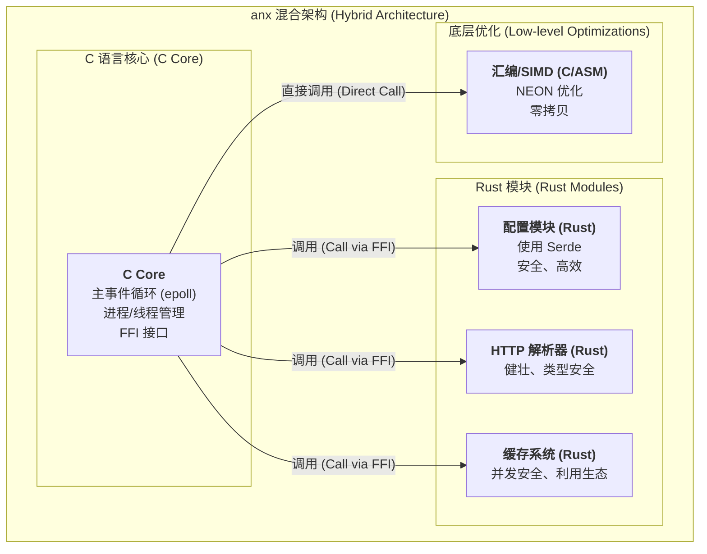

# anx - 架构与现代化演进计划

本文档阐述了 `anx` 项目从纯C实现向 **C/Rust混合架构** 演进的战略、目标和技术路线图。此举旨在将 `anx` 打造为下一代高性能、高安全性的Web服务器。

---

## 1. 战略决策：为什么集成Rust？

`anx` 的初心是通过C和底层汇编优化，在性能上达到甚至超越现有解决方案。我们已经证明了这条路在性能上的可行性。然而，要构建一个能够长期演进并被广泛信赖的系统，**安全性、稳定性和可维护性**与极致性能同等重要。

| 特性维度 | C + aarch64汇编 (当前) | Rust | 战略考量 |
| :--- | :--- | :--- | :--- |
| **极致性能** | 🏆 **顶峰** | 🥈 **极高** | 性能并非瓶颈，C和Rust都能达到顶尖水平。 |
| **安全性** | ⚠️ **高风险** (内存/并发安全依赖开发者) | 🏆 **无可匹敌** (编译时保障) | **这是我们进行架构升级的核心驱动力。** Rust能从根本上消除一整类致命的安全漏洞。 |
| **并发模型** | 😥 **困难** (手动管理锁，易错) | 😊 **现代化且安全** (`async/await`) | Rust能让我们更轻松、更安全地开发复杂的异步功能。 |
| **开发效率** | 😐 **一般** (手动依赖管理，开发慢) | 🚀 **优秀** (Cargo包管理，生态丰富) | Rust能显著加快新功能的开发速度和迭代周期。 |

**结论**: 我们集成Rust，**不是为了替换C，而是为了增强C**。我们的目标是结合C/汇编的极致性能和Rust的极致安全，创造出一个前所未有的服务器架构。

---

## 2. 混合架构：我们的前进之路

我们将采用一种低风险、高收益的**混合动力（Hybrid）**架构。

- **C语言核心 (C Core)**: 继续负责它最擅长的部分——与操作系统底层交互，包括主事件循环(`epoll`)、进程/线程管理和信号处理。它将作为整个系统的稳定基石。
- **Rust模块 (Rust Modules)**: 负责处理复杂的、易错的业务逻辑，如配置解析、HTTP协议处理、缓存逻辑等。新功能将优先使用Rust开发。
- **底层优化 (Low-level Optimizations)**: 我们已经完成的aarch64汇编优化模块将保持不变，由C核心直接调用，确保性能不受任何影响。

### 架构图



---

## 3. 下一代配置系统：简单、强大且兼容

为了提升用户体验和开发效率，我们将引入一个全新的配置系统，它包含两个部分：

### 3.1. 原生TOML配置

我们将设计一种基于 **TOML (Tom's Obvious, Minimal Language)** 的新配置格式。

- **优点**:
    - **语法简单清晰**: 比类Nginx的语法更容易阅读和编写，减少了学习成本。
    - **表达力强**: 能清晰地表达复杂的嵌套结构和数据类型。
    - **生态成熟**: 在Rust中，可以使用强大的 `serde` 库进行自动、安全、高效的解析。

**原生配置示例 (`anx.toml`)**:
```toml
# anx.toml - 新的原生配置文件

[server]
listen = "0.0.0.0:8080"
server_name = "example.com"
error_log = "/var/log/anx_error.log"

[server.gzip]
enable = true
level = 5

[[server.locations]]
path = "/"
root = "/var/www/html"
index = "index.html"

[[server.locations]]
path = "/api/"
proxy_pass = "http://127.0.0.1:9000"
```

### 3.2. Nginx配置兼容层

为了方便现有Nginx用户无缝迁移，我们将提供一个**兼容层**。

- **实现方式**: 我们将利用现有的C语言解析器或创建一个新的Rust解析器，它可以读取**大部分常见**的Nginx配置指令，并将其在内部**转换为我们新的TOML配置结构**。
- **目标**: 用户可以将现有的 `nginx.conf` 文件（或稍作修改）直接用于 `anx`，而无需重写整个配置文件。
- **声明**: 这将是一个尽力而为的兼容性工具，可能不会支持所有Nginx的冷门或复杂指令，但会覆盖90%以上的常见用例。

---

## 4. 实施路线图

我们将分阶段将此架构变为现实，详细计划将更新到 `ROADMAP.md` 中。

1.  **第一阶段：配置系统革命**
    - 使用Rust和`serde`实现原生的TOML配置解析器。
    - 通过FFI将其集成到C核心中，让`anx`能读取`anx.toml`启动。
2.  **第二阶段：兼容Nginx**
    - 开发Nginx配置兼容层。
3.  **第三阶段：核心逻辑现代化**
    - 逐步将HTTP解析、缓存等模块替换为更安全的Rust实现。 